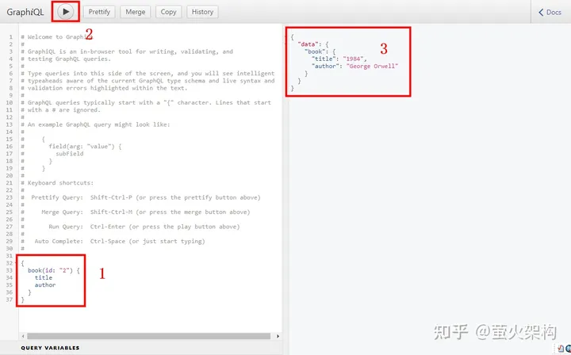

# GraphQL简要

## 1 GraphQL简介

- 什么是GraphQL？

  GraphQL，一个API查询语言，它不同于传统的REST API，GraphQL允许客户端按需获取数据。就像你去自助餐厅，你可以自己决定要哪些食物，而不是服务员决定给你什么。这种方式让前端开发者不用依赖后端的接口设计，他们可以自由地获取他们需要的数据结构。

- GraphQL的起源

  GraphQL最初由Facebook开发，并于2015年开源。它解决了Facebook在构建移动应用时遇到的一些问题，例如多端之间的数据需求不一致，导致需要多个版本的API。GraphQL的诞生，打开了前后端数据交流的新局面，一度引起了开发社区的极大兴趣。

## 2 GraphQL的优势

因为GraphQL主要是用来替代REST API的，所以我们这里谈的也是相对REST的优势。

- 客户端精确获取所需资源

  在REST API中，服务端定义了数据的结构，客户端无法自定义需要的数据结构，这就像是买了一套套装，即使你只喜欢里面的一件衣服。GraphQL允许客户端像挑选菜单上的菜一样，只获取它们真正需要的数据。

- 减少冗余和提高效率

  使用REST API时，可能需要多个请求来聚合所需的数据，这就像是去多个商店购物，每个商店只能买一种商品。而GraphQL可以通过一次请求，获取多种资源，这就如同一站式购物，既省时又方便。

- 简化客户端代码

  在REST中，客户端需要根据不同的URL编写不同的解析代码，这就像是每次去不同的商店都需要懂得不同的支付方式。GraphQL则提供了统一的Type和Field的访问方式，客户端不需要写复杂的解析代码，一种支付方式逛遍所有商店。

## 3 如何实现GraphQL？

### 3.1 服务端的角色

- 定义Type及其Field

  服务端需要定义各种数据类型，包括标量类型（基本数据类型）、对象类型（复杂数据类型）、接口类型、联合类型、枚举类型、输入对象类型等。这就像是在自助餐厅中，厨师需要准备各种食材和菜品，以满足顾客的不同需求。

- 定义Schema

  Schema是GraphQL的核心，它定义了客户端可以进行的操作（query、mutation、subscription）以及这些操作如何获取数据。这就像是餐厅的菜单，上面列出了所有可以点的菜，以及它们是怎么做的。

- 定义Resolve

  Resolver是实际处理数据请求的函数。当客户端发起一个请求时，Resolver负责获取数据并返回给客户端。这就像是餐厅里的服务员，根据顾客的订单去厨房取菜。

### 3.2 客户端的角色

- 构建请求Document

  客户端在发送请求时，需要构建一个请求Document，它包括操作和片段。这就像是在自助餐厅中，你填写订单，上面标明你想要哪些菜品。

### 3.3 实战示例

好的，接下来我会给出一个简单的Node.js示例，用于创建一个GraphQL服务。这个服务将允许客户端查询一本书的信息。

- 首先，我们需要安装一些必要的包：

  ```
  npm install express express-graphql graphql --save
  ```

  这里我们使用 express 作为Web服务器，使用 express-graphql 在 Express 中集成 GraphQL，使用 graphql 这个包来实现 GraphQL。

- 现在我们来编写代码：

  ```
  const express = require('express');
  const { graphqlHTTP } = require('express-graphql');
  const { buildSchema } = require('graphql');
  
  // 使用GraphQL schema language构建一个schema
  const schema = buildSchema(`
    type Query {
      book(id: ID!): Book
    }
    type Book {
      id: ID
      title: String
      author: String
    }
  `);
  
  // 根提供了每个API端点的Resolve函数
  const root = {
    book: ({id}) => {
      // 这里应该是数据库的查询逻辑，但为了示例简单，我们使用了硬编码的数据
      const books = [
        { id: '1', title: 'The Great Gatsby', author: 'F. Scott Fitzgerald' },
        { id: '2', title: '1984', author: 'George Orwell' },
        { id: '3', title: 'The Catcher in the Rye', author: 'J.D. Salinger' },
      ];
      return books.find(book => book.id === id);
    },
  };
  
  const app = express();
  app.use('/graphql', graphqlHTTP({
    schema: schema,
    rootValue: root,
    graphiql: true, // 开启GraphiQL工具
  }));
  app.listen(4000, () => console.log('Now browse to localhost:4000/graphql'));
  ```

  在这段代码中，我们首先定义了一个schema，它描述了查询类型Query和一个Book类型。在Query类型中，我们定义了一个book查询，它接受一个必需的id参数，并返回一个Book对象。

- 接下来，我们定义了一个根解析器root，它包含了一个book函数。这个函数接受一个包含id的参数对象，并返回匹配该id的书籍信息。在真实应用中，这里应该是一个数据库查询操作。

- 最后，我们使用Express创建了一个应用，通过express-graphql中间件在/graphql路径上提供GraphQL服务，并开启了GraphiQL，这是一个内嵌的Web IDE，用于在浏览器中测试GraphQL查询。

- 现在，如果你运行这段代码，并在浏览器中打开http://localhost:4000/graphql，你就可以使用GraphiQL工具来执行GraphQL查询了。例如，使用下面的查询：

  ```json
  {
    book(id: "2") {
      title
      author
    }
  }
  ```

- 演示效果如下，这将返回id为"2"的书的标题和作者信息。

  

## 4 GraphQL的局限性

- 学习曲线

  GraphQL引入了新的概念和语法，这意味着开发者需要花时间学习和适应。对于已经习惯于REST API的开发者来说，这是一个不小的挑战。正如学习任何新技术一样，需要投入时间和精力，这对于忙碌的开发团队来说可能是一大负担。

- 现有基础设施的兼容性

  许多公司已经投入了大量资源建立起基于REST的服务架构，要迁移到GraphQL，需要重构现有的API和后端服务。这种转变涉及到时间和成本的投入，对于那些已经运行良好的服务来说，这样的投资可能难以说服管理者，这个事就干不成，即使有前端同学愿意用爱发电，还得说服后端一起发电才行，难度可想而知。

- 不适用的场景

  虽然GraphQL强大，但它并不适用于所有场景。例如，对于一些简单的项目，只有几个API，使用GraphQL可能有点大材小用，而且还需要学习新的查询语言。就像是为了买一瓶水而去开一辆卡车，有些不必要。

  还有GraphQL不适合传输二进制数据。

- 单一端点的缓存问题

  由于GraphQL通常只使用一个端点，这使得基于URL的缓存变得困难。这就像是自助餐厅中，所有的食物都在一个窗口领取，导致排队等待的时间变长。
安全性和性能问题

  GraphQL的灵活性虽然是一个优点，但也带来了潜在的安全风险。它主要关注数据检索，但忽略了其他重要的 API 方面，如身份验证、授权和错误处理。还有恶意用户可能通过复杂的查询来对服务器进行攻击（例如，深度查询和循环查询）。此外，由于GraphQL允许客户端制定查询，这可能导致非预期的数据库性能问题。

- 总结

  GraphQL是一个强大的API查询语言，它通过允许客户端精确地获取所需的数据，减少了数据传输中的冗余，并简化了客户端的数据处理。对于需要高度灵活性和效率的现代应用程序，GraphQL提供了一个非常有吸引力的解决方案。

然而，随着时间的推移，GraphQL 的发展并没有像预期的那样顺利。在实践中，GraphQL 面临很多挑战：对于小型应用程序来说，GraphQL 过于复杂；对于初学者来说，学习曲线有点陡峭；开发人员仍然需要处理安全方面额外的复杂性。在很多情况下，使用传统的 RESTful API 还是会更靠谱一些。
