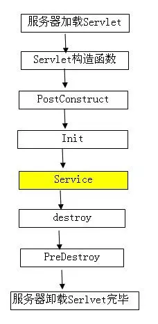

# Java的各种注释

##  @Primary

> https://www.cnblogs.com/fnlingnzb-learner/p/16803858.html

### 1.概述

讨论`Spring`的@`Primary`注解，该注解是框架在3.0版中引入的。

其作用与功能，当有多个相同类型的`bean`时，使用`@Primary`来赋予`bean`更高的**优先级**。

### 2.为什么需要@Primary？

在某些情况下，需要注册多个相同类型的`bean`。

- 在此示例中，有`Employee`类型的`zhangSanEmployee()`和`liSiEmployee()` 的 `Bean`：

  ```java
  @Configuration
  public class PrimaryConfig {
  	@Bean
  	public Employee zhangSanEmployee() {
  		return new Employee("张三");
  	}
  
  	@Bean
  	public Employee liSiEmployee() {
  		return new Employee("李四");
  	}
  }
  ```

  如果尝试运行应用程序，与`@Autowired`一起应用于注入。Spring会抛出`NoUniqueBeanDefinitionException`。

- 要访问相同类型的bean，常使用`@Qualifier("beanName")`注解，通过别名控制访问相同类型。

  ```java
  @Configuration
  public class PrimaryConfig {
  
     @Bean
     @Qualifier("zhangSanEmployee")
     public Employee zhangSanEmployee() {
  	   return new Employee("张三");
     }
  
     @Bean
     @Qualifier("liSiEmployee")
     public Employee liSiEmployee() {
  	   return new Employee("李四");
     }
  }
  ```

  注入

  ```java
  @Resource
  private Employee zhangSanEmployee;
  
  @Resource
  private Employee liSiEmployee;
  ```

### 3.将`@Primary`和`@Bean`一起使用

- 看一下配置类：

  ```java
  @Configuration
  public class PrimaryConfig {
  
  	@Bean
  	public Employee zhangSanEmployee() {
  		return new Employee("张三");
  	}
  
  	@Bean
  	@Primary
  	public Employee liSiEmployee() {
  		return new Employee("李四");
  	}
  }
  ```

  用`@Primary`标记`liSiEmployee()`bean。 Spring将优先于`zhangSanEmployee()`注入`liSiEmployee()`bean。

  ```java
  @Test
  public void test1() {
  	AnnotationConfigApplicationContext context
  		= new AnnotationConfigApplicationContext(PrimaryConfig.class);
  
  	Employee employee = context.getBean(Employee.class);
  	System.out.println(employee);//Employee(name=李四)
  
  }
  ```

### 4.将`@Primary`与`@Component`一起使用

- 可以直接在bean上使用@Primary。

  ```java
  public interface Manager {
  	String getManagerName();
  }
  ```

- 有一个`Manager`接口和两个子类bean

  ```java
  @Component
  public class DepartmentManager implements Manager {
  	@Override
  	public String getManagerName() {
  		return "Department manager";
  	}
  }
  ```

  ```java
  @Component
  @Primary
  public class GeneralManager implements Manager {
  	@Override
  	public String getManagerName() {
  		return "General manager";
  	}
  }
  ```

- 都覆盖`Manager`接口的`getManagerName()`。 另外，请注意，用`@Primary`标记了`GeneralManager` bean。

  ```java
  @Service
  public class ManagerService {
  
  	@Autowired
  	private Manager manager;
  
  	public Manager getManager() {
  		return manager;
  	}
  }
  ```

- 测试

  ```java
  @RunWith(SpringRunner.class)
  @SpringBootTest
  public class PrimaryTest {
  	@Resource
  	private ApplicationContext context;
  	@Test
  	public void test2() {
  		ManagerService service = context.getBean(ManagerService.class);
  		Manager manager = service.getManager();
  		System.out.println(manager.getManagerName());//General manager
  	}
  }
  ```

## @Autowired

在开发中经常使用到`@Autowired`注解，一般用在`Service`前面、`Dao`前面、`Config`前面，但是这个注解究竟是什么作用呢。

网上经常有这样的解释：

> @Autowired 是一个注解，它可以对类成员变量、方法及构造函数进行标注，让 spring 完成 `bean` 自动装配的工作

但是自动装配做了什么呢，或者说，我直接new一个不可以吗？

实际情况其实更复杂，比如一个系统需要一个 `paymentService` 的对象做支付，也许整个系统只需要一个`paymentService`的实例，所以必须得判断那个要用的Object有没有，没有才创建。但有时，对于一些Object可能每次都需要一个新的实例。一个更好的办法是，每个Object可以定义自己的初始化静态工厂方法完成初始化，都封装在里面，然后别的地方都调用这个方法。

### 1. 静态注入

静态注入的本质是弄一个全局的大KV，`key`是那个`Object`的类，`value`就是`new`出来的所有`Object`。这时你编写代码的逻辑就是：

1. 创建这个大KV
2. 手工`new`或者通过静态方法创建第一个没有任何依赖的`Object`，并记录到大KV里
3. 手工`new`或者通过静态方法创建其他`Object`，如果创建时需要依赖已经创建好的`Object`，就从KV里取出来直接用
4. 所有的`Object`都创建完了，服务就可以启动了

### 2. 动态注入
另一类被称为运行时注入，又叫做动态注入。代表是`Spring`和`Guice`。以`Spring`为例，你只需要定义两类信息：

- 你要如何初始化Object（如何创建/单例、多例还是要弄个什么`Factory`有没有自定义初始化代码等）
- 你的Object依赖什么Object（可以通过class或者name来描述）

其余的Spring都帮你直接搞定。使用Spring的程序一启动就开始根据当前的配置信息，`classpath`等**各种静态 + 运行时信息**帮你搞定一切。


**以下是@Autowired在实际中的策略：**

- 如果`required`属性被设置为`true`，那么只有一个构造方法可以用`@Autowired`注解。

- 通过在Spring容器中匹配bean可以满足的依赖关系最多的构造方法将被选择。

- 如果不存在满足匹配的候选构造方法，则将会使用 `primary/default` 构造方法

- 如果存在多个同类型的Bean实例，需要注意的是，在使用`@Autowired`注入时，会根据字段的名称去容器中找实例。所以，`OrderController`注入的是`coffee2`实例。

[Guide to Spring @Autowired | Baeldung](https://link.zhihu.com/?target=https%3A//www.baeldung.com/spring-autowire)这里是一个Spring Boot对@Aotowired的教程

## @component

### 1. 介绍

1. `@controller` 控制器（注入服务）
   用于标注控制层，相当于[struts](https://so.csdn.net/so/search?q=struts&spm=1001.2101.3001.7020)中的action层

2. `@service` 服务（注入dao）
   用于标注服务层，主要用来进行业务的逻辑处理

3. `@repository`（实现dao访问）
   用于标注数据访问层，也可以说用于标注数据访问组件，即DAO组件.

4. `@component` （把普通`pojo`实例化到`spring`容器中，相当于配置文件中的 `<bean id="" class=""/>`）
   泛指各种组件，就是说当我们的类不属于各种归类的时候（不属于`@Controller`、`@Services`等的时候），我们就可以使用`@Component`来标注这个类。

### 2. 说明 

下面写这个是引入`component`的扫描组件 （这是在配置文件中的书写格式,如`spring mvc`中的`applicationcontent.xml`，在`spring boot`中的话，因采用的是零配置所以要直接在类上加入`@component`注解就可以了）

```
<context:component-scan base-package=”com.mmnc”> 
```

上面的这个例子是引入`Component`组件的例子，其中`base-package`表示为需要扫描的所有子包。 
共同点：被`@controller` 、`@service`、`@repository` 、`@component` 注解的类，都会把这些类纳入进`spring`容器中进行管理

转载于:https://www.cnblogs.com/w-essay/p/11493023.html

### 3. 用法

踩到一个坑，有一个接口，在这个接口的实现类里，需要用到@Autowired注解，一时大意，没有在实现类上加上@Component注解，导致了Spring报错，找不到这个类

一旦使用关于Spring的注解出现在类里，例如我在实现类中用到了@Autowired注解，被注解的这个类是从Spring容器中取出来的，那调用的实现类也需要被Spring容器管理，加上@Component

```java
@Component("conversionImpl")
// 其实默认的spring中的Bean id 为 conversionImpl(首字母小写)
public class ConversionImpl implements Conversion {
	@Autowired
	private RedisClient redisClient;
}
```

## @Configuration

### 1. 基本用法

#### (a) 基本介绍

**Spring Boot** 推荐使用 **java** 配置完全代替 **XML** 配置，**java** 配置是通过 **@Configration** 和 **@Bean** 注解实现的。二者作用如下：

- **@Configration 注解**：声明当前类是一个配置类，相当于 **Spring** 中的一个 **XML** 文件
- **@Bean 注解**：作用在方法上，声明当前方法的返回值是一个 **Bean**

#### (b) 简单样例

- （1）首先创建一个自定义的配置类 **MyConfigration**：

  - 使用 **@Configration** 注解将该类声明为一个配置类。
  - 在 **hello()** 方法上添加 **@Bean** 注解则会往 **Spring** 容器中添加一个名为 **hello** 的 **Bean**，该 **Bean** 即为方法的返回值。

  ```java
  package com.example.demo.component;
   
  import org.springframework.context.annotation.Bean;
  import org.springframework.context.annotation.Configuration;
   
  @Configuration
  public class MyConfigration {
      @Bean
      public String hello() {
          return "welcome to hangge.com";
      }
  }
  ```

- （2）下面我们在一个 **Controller** 中获取并使用这个 **Bean**，代码如下：

  ```java
  package com.example.demo.controller;
   
  import org.springframework.beans.factory.annotation.Autowired;
  import org.springframework.web.bind.annotation.GetMapping;
  import org.springframework.web.bind.annotation.RestController;
   
  @RestController
  public class HelloController {
   
      @Autowired
      String hello;
   
      @GetMapping("/test")
      public String test() {
          return hello;
      }
  }
  ```

- （3）访问这个 **Controller**，运行结果如下：

  [](https://www.hangge.com/blog/cache/detail_2506.html#)


### 2. @Bean 注解详解

#### (a) 使用说明

- **@Bean** 注解作用在方法上
- **@Bean** 指示一个方法返回一个 **Spring** 容器管理的 **Bean**
- **@Bean** 方法名与返回类名一致，首字母小写
- **@Bean** 一般和 **@Component** 或者 **@Configuration** 一起使用
- **@Bean** 注解默认作用域为单例 **singleton** 作用域，可通过 **@Scope(“prototype”)** 设置为原型作用域

#### (b) Bean 名称

- 默认情况下 **Bean** 名称就是方法名，比如下面 **Bean** 名称便是 **myBean**：

  ```java
  @Bean
  public MyBean myBean() {
      return new MyBean();
  }
  ```

- **@Bean** 注解支持设置别名。比如下面除了主名称 **myBean** 外，还有个别名 **myBean1**（两个都可以使用）

  ```java
  @Bean("myBean1")
  public MyBean myBean() {
      return new MyBean();
  }
  ```

- **@Bean** 注解可以接受一个 **String** 数组设置多个别名。比如下面除了主名称 **myBean** 外，还有别名 **myBean1**、**myBean2**（三个都可以使用）

  ```java
  @Bean({"myBean1", "myBean2"})
  public MyBean myBean() {
      return new MyBean();
  }
  ```

#### (c) @Bean 与其他注解一起使用

- **@Bean** 注解常常与 **@Scope**、**@Lazy**，**@DependsOn** 和 **@link Primary** 注解一起使用：

  - **@Profile** 注解：为在不同环境下使用不同的配置提供了支持，如开发环境和生产环境的数据库配置是不同的
  - **@Scope** 注解：将 **Bean** 的作用域从单例改变为指定的作用域
  - **@Lazy** 注解：只有在默认单例作用域的情况下才有实际效果
  - **@DependsOn** 注解：表示在当前 **Bean** 创建之前需要先创建特定的其他 **Bean**

- 比如下面样例，**Bean** 的作用域默认是单例的，我们配合 **@Scope** 注解将其改成 **prototype** 原型模式（每次获取 **Bean** 的时候会有一个新的实例）

  ```java
  @Bean()
  @Scope("prototype")
  public MyBean myBean() {
      return new MyBean();
  }
  ```

#### (d) Bean 初始化和销毁时调用相应的方法 

- 实际开发中，经常会遇到在 **Bean** 使用之前或使用之后做些必要的操作，**Spring** 对 **Bean** 的生命周期的操作提供了支持：我们可以通过 **@Bean** 注解的 **initMethod** 和 **destrodMethod** 进行指定 **Bean** 在初始化和销毁时需要调用相应的方法。 

- 下面是一个简单的样例：

  ```java
  public class MyBean {
      public void init() {
          System.out.println("MyBean开始初始化...");
      }
   
      public void destroy() {
          System.out.println("MyBean销毁...");
      }
   
      public String get() {
          return "MyBean使用...";
      }
  }
  ```

  ```java
  @Bean(initMethod="init", destroyMethod="destroy")
  public MyBean myBean() {
      return new MyBean();
  }
  ```

### 3. @Configration 注解详解

#### (a) 使用说明

- **@Configration** 注解作用在类、接口（包含注解）上
- **@Configuration** 用于定义配置类，可替换 **xml** 配置文件
- **@Configration** 注解类中可以声明一个或多个 **@Bean** 方法
- **@Configration** 注解作用的类不能是 **final** 类型
- 嵌套的 **@Configration** 类必须是 **static** 的

#### (b) 声明一个 @Bean 方法

- 假设我们定义一个如下的 **Bean**：

  ```java
  package com.example.demo.bean;
   
  public class MyBean {
      private String port;
   
      public void init() {
          System.out.println("MyBean开始初始化...");
      }
   
      public void destroy() {
          System.out.println("MyBean销毁...");
      }
   
      public String get() {
          return "端口号： " + getPort();
      }
   
      public String getPort() {
          return port;
      }
   
      public void setPort(String port) {
          this.port = port;
      }
  }
  ```

- 然后在 **Configuration** 中进行声明：

  ```java
  @Configuration
  public class MyConfigration {
      @Bean(initMethod="init", destroyMethod="destroy")
      public MyBean myBean() {
          MyBean myBean = new MyBean();
          myBean.setPort("8080");
          return myBean;
      }
  }
  ```

- 最后进行测试，我们获取这个 **Bean** 并输出其内容：

  ```java
  @SpringBootApplication
  public class DemoApplication {
   
      public static void main(String[] args) {
          ConfigurableApplicationContext context
                  = SpringApplication.run(DemoApplication.class, args);
          MyBean myBean = (MyBean) context.getBean("myBean");
          System.out.println(myBean.get());
      }
  }
  ```

  

#### (c) 声明多个 @Bean 方法

- **@Configration** 注解类中可以声明多个 **@Bean** 方法，并且 **bean** 与 **bean** 之间是可以有依赖关系的。如果一个 **bean** 的定义依赖其他 **bean**，则直接调用对应的 **JavaConfig** 类中依赖 **bean** 的创建方法就可以了。

- 下面是一个简单的样例，一共声明了 **country** 和 **userInfo** 两个 **Bean**。

  > **注意**：**@Configuration** 注解的 **bean** 都已经变成了增强的类。因此上面的 **country** 这个 **Bean** 和下面直接调用 **country()** 方法返回的是同一个实例
  
  ```java
  @Configuration
  public class MyBeanConfig {
    
      @Bean
      public Country country(){
          return new Country();
      }
    
      @Bean
      public UserInfo userInfo(){
          return new UserInfo(country());
      }
  }
  ```

参考URL：

- https://www.hangge.com/blog/cache/detail_2506.html

- 上一篇[SpringBoot - 自定义错误页3（高级：完全自定义Error数据、Error视图）](https://www.hangge.com/blog/cache/detail_2504.html)
- 下一篇[SpringBoot - 拦截器的注册和使用（附样例）](https://www.hangge.com/blog/cache/detail_2507.html)

## @SuppressWarnings（"unchecked"）

### 1. 简介：

java.lang.SuppressWarnings是J2SE5.0中标准的Annotation之一。可以标注在类、字段、方法、参数、构造方法，以及局部变量上。

- **作用：**  
  告诉编译器忽略指定的警告，不用在编译完成后出现警告信息。
  
- **使用：**  
  
  - @SuppressWarnings(“”)
  
  - @SuppressWarnings({})
  - @SuppressWarnings(value={})
  
- **根据sun的官方文档描述：**  
  value -将由编译器在注释的元素中取消显示的警告集。允许使用重复的名称。忽略第二个和后面出现的名称。出现未被识别的警告名*不是*错误：编译器必须忽略无法识别的所有警告名。但如果某个注释包含未被识别的警告名，那么编译器可以随意发出一个警告。
  各编译器供应商应该将它们所支持的警告名连同注释类型一起记录。鼓励各供应商之间相互合作，确保在多个编译器中使用相同的名称。

- ***\*示例：\****
  - @SuppressWarnings("unchecke d")
    告诉编译器忽略 unchecked 警告信息，如使用List，ArrayList等未进行参数化产生的警告信息。
  - @SuppressWarnings("serial")
    如果编译器出现这样的警告信息：The serializable class WmailCalendar does notdeclare a static final serialVersionUID field of type long 使用这个注释将警告信息去掉。
  - @SuppressWarnings("deprecation")
    如果使用了使用@Deprecated注释的方法，编译器将出现警告信息。 使用这个注释将警告信息去掉。
  - @SuppressWarnings("unchecked", "deprecation")
    告诉编译器同时忽略unchecked和deprecation的警告信息。
  - @SuppressWarnings(value={"unchecked", "deprecation"})
    等同于@SuppressWarnings("unchecked", "deprecation")　　　　　　　　　　　　　　　　　　　　　　　　　　　　　　　

 

- 编码时我们总会发现如下变量未被使用的警告提示：
  
  上述代码编译通过且可以运行，但每行前面的“感叹号”就严重阻碍了我们判断该行是否设置的断点了。这时我们可以在方法前添加 @SuppressWarnings("unused") 去除这些“感叹号”。

### 2. 示例　　　　　　　　　　　　　　　　　　　　　　　　　

作用：用于抑制编译器产生警告信息。

- 示例1——抑制单类型的警告：

  ```java
  @SuppressWarnings("unchecked")
  public void addItems(String item){
    @SuppressWarnings("rawtypes")
    List items = new ArrayList();
    items.add(item);
  }
  ```

- 示例2——抑制多类型的警告：

  ```java
  @SuppressWarnings(value={"unchecked", "rawtypes"})
  public void addItems(String item){
    List items = new ArrayList();
    items.add(item);
  }
  ```

- 示例3——抑制所有类型的警告：

  ```java
  @SuppressWarnings("all")
  public void addItems(String item){
    List items = new ArrayList();
    items.add(item);
  }
  ```

  

### 3. 注解目标　　　　　　　　　　　　　　　　　　　　　　　　　　　　　　　　

通过 @SuppressWarnings 的源码可知，其注解目标为类、字段、函数、函数入参、构造函数和函数的局部变量。

而家建议注解应声明在最接近警告发生的位置。

### 4. 抑制警告的关键字

- 关键字列表

  | ***\*关键字\****         | ***\*用途\****                                               |
  | ------------------------ | ------------------------------------------------------------ |
  | all                      | to suppress all warnings（抑制所有警告）                     |
  | boxing                   | to suppress warnings relative to boxing/unboxing operations（要抑制与箱/非装箱操作相关的警告） |
  | cast                     | to suppress warnings relative to cast operations（为了抑制与强制转换操作相关的警告） |
  | dep-ann                  | to suppress warnings relative to deprecated annotation（要抑制相对于弃用注释的警告） |
  | deprecation              | to suppress warnings relative to deprecation（要抑制相对于弃用的警告） |
  | fallthrough              | to suppress warnings relative to missing breaks in switch statements（在switch语句中，抑制与缺失中断相关的警告） |
  | finally                  | to suppress warnings relative to finally block that don’t return（为了抑制警告，相对于最终阻止不返回的警告） |
  | hiding                   | to suppress warnings relative to locals that hide variable（为了抑制本地隐藏变量的警告） |
  | incomplete-switch        | to suppress warnings relative to missing entries in a switch statement (enum case)（为了在switch语句（enum案例）中抑制相对于缺失条目的警告） |
  | nls                      | to suppress warnings relative to non-nls string literals（要抑制相对于非nls字符串字面量的警告） |
  | null                     | to suppress warnings relative to null analysis（为了抑制与null分析相关的警告） |
  | rawtypes                 | to suppress warnings relative to un-specific types when using generics on class params（在类params上使用泛型时，要抑制相对于非特异性类型的警告） |
  | restriction              | to suppress warnings relative to usage of discouraged or forbidden references（禁止使用警告或禁止引用的警告） |
  | serial                   | to suppress warnings relative to missing serialVersionUID field for a serializable class（为了一个可串行化的类，为了抑制相对于缺失的serialVersionUID字段的警告） |
  | static-access            | o suppress warnings relative to incorrect static access（o抑制与不正确的静态访问相关的警告） |
  | synthetic-access         | to suppress warnings relative to unoptimized access from inner classes（相对于内部类的未优化访问，来抑制警告） |
  | unchecked                | to suppress warnings relative to unchecked operations（相对于不受约束的操作，抑制警告） |
  | unqualified-field-access | to suppress warnings relative to field access unqualified（为了抑制与现场访问相关的警告） |
  | unused                   | to suppress warnings relative to unused code（抑制没有使用过代码的警告） |

### 5. Java Lint选项　　　　　　　　　　　　　　　　　　　　　　　　　　　　

1. lint的含义

   用于在编译程序的过程中，进行更细节的额外检查。

2. javac 的标准选项和非标准选项
   - 标准选项：是指当前版本和未来版本中都支持的选项，如 -cp 和 -d 等。

   - 非标准选项：是指当前版本支持，但未来不一定支持的选项。通过 javac -X 查看当前版本支持的非标准选项。
   
     http://images.cnitblog.com/blog/347002/201410/211648020124434.png

  3. 查看警告信息

     默认情况下执行 javac 仅仅显示警告的扼要信息，也不过阻止编译过程。若想查看警告的详细信息，则需要执行 javac -Xlint:keyword 来编译源码了。

### 6. 总结　　　　　　　　　　　　　　　　　　　　　　　　　　　　　　　　　　

  现在再都不怕不知道设置断点没有咯！

  尊重原创，转载请注明来自：http://www.cnblogs.com/fsjohnhuang/p/4040785.html

## @PostConstruct

> https://www.cnblogs.com/fnlingnzb-learner/p/10758848.html

### 1. 注解解释

Spring的@PostConstruct注解在方法上，表示此方法是在Spring实例化该Bean之后马上执行此方法，之后才会去实例化其他Bean，并且一个Bean中@PostConstruct注解的方法可以有多个。

### 2. 示例代码

1. spring配置文件

   ```xml
   <?xml version="1.0" encoding="UTF-8"?>  
   <beans xmlns="http://www.springframework.org/schema/beans" xmlns:xsi="http://www.w3.org/2001/XMLSchema-instance" xmlns:context="http://www.springframework.org/schema/context" xsi:schemaLocation="  
   http://www.springframework.org/schema/beans   
   http://www.springframework.org/schema/beans/spring-beans-3.0.xsd   
   http://www.springframework.org/schema/context   
   http://www.springframework.org/schema/context/spring-context-3.0.xsd  
   ">  
   	
   	<!-- 引入属性文件 -->
   	<context:property-placeholder location="classpath:config.properties" />
   	
   	<!-- 自动扫描dao和service包(自动注入) -->
   	<context:component-scan base-package="com.wbf.bean" />
   	
   </beans>
   ```

2. Bean1.java

   ```java
   package com.wbf.bean;
   
   import javax.annotation.PostConstruct;
   
   import org.apache.log4j.Logger;
   import org.springframework.stereotype.Service;
   
   @Service("bean1")
   public class Bean1 {
   
   	private static final Logger log = Logger.getLogger(Bean1.class);
   	
   	public Bean1() {
   		log.info(System.currentTimeMillis() + ": Bean1 Constructor");
   	}
   	
   	@PostConstruct
   	public void test() {
   		log.info(System.currentTimeMillis() + ": bean1-->test()");
   		Bean2.uniqueInstance().test();
   	
   	}
   	
   	@PostConstruct
   	public void print() {
   		log.info(System.currentTimeMillis() + ": bean1-->print()");
   	}
   }
   ```

3. Bean2.java

   ```java
   package com.wbf.bean;
   
   import org.apache.log4j.Logger;
   
   public class Bean2 {
   
   	private static final Logger log = Logger.getLogger(Bean2.class);
   	
   	private static Bean2 instance = uniqueInstance();
   	
   	public static Bean2 uniqueInstance() {
   		if (instance == null)
   			instance = new Bean2();
   		
   		return instance;
   	}
   	
   	public Bean2() {
   		log.info(System.currentTimeMillis() + ": Bean2 Construtor");
   	}
   	
   	public void test() {
   		log.info(System.currentTimeMillis() + ": bean2-->test()");
   	}
   }
   ```

4. Bean3.java

   ```java
   package com.wbf.bean;
   
   import org.apache.log4j.Logger;
   import org.springframework.stereotype.Service;
   
   @Service("bean3")
   public class Bean3 {
   
   	private static final Logger log = Logger.getLogger(Bean3.class);
   	
   	public Bean3() {
   		log.info(System.currentTimeMillis() + ": Bean3 Construtor");
   	}
   }
   ```

5. SpringTest.java

   ```java
   package com.wbf.bean;
   
   import org.junit.Test;
   import org.springframework.context.ApplicationContext;
   import org.springframework.context.support.ClassPathXmlApplicationContext;
   
   public class SpringTest {
   
   	@Test
   	public void test() {
   		//加载/解析spring.xml, 得到BeanFactory, 实例化所有IOC容器中的Bean
   		//在实例化每一个Bean之后，如果当前Bean包含@PostConstruct注解的方法则会马上执行该方法，之后才会去实例化其他的Bean
   		//每一个Bean中可以有多个包含@PostConstruct注解的方法
   		ApplicationContext ac = new ClassPathXmlApplicationContext(new String[]{"classpath:spring.xml"});
   	}
   }
   ```

- 运行结果：

  ```
  [org.springframework.context.support.ClassPathXmlApplicationContext]Refreshing org.springframework.context.support.ClassPathXmlApplicationContext@b0f2b2: startup date [Thu Jun 11 11:51:17 CST 2015]; root of context hierarchy  
  [org.springframework.beans.factory.xml.XmlBeanDefinitionReader]Loading XML bean definitions from class path resource [spring.xml]  
  [org.springframework.beans.factory.config.PropertyPlaceholderConfigurer]Loading properties file from class path resource [config.properties]  
  [org.springframework.beans.factory.annotation.AutowiredAnnotationBeanPostProcessor]JSR-330 'javax.inject.Inject' annotation found and supported for autowiring  
  [org.springframework.beans.factory.support.DefaultListableBeanFactory]Pre-instantiating singletons in org.springframework.beans.factory.support.DefaultListableBeanFactory@1b8dc93: defining beans [org.springframework.beans.factory.config.PropertyPlaceholderConfigurer#0,bean1,bean3,org.springframework.context.annotation.internalConfigurationAnnotationProcessor,org.springframework.context.annotation.internalAutowiredAnnotationProcessor,org.springframework.context.annotation.internalRequiredAnnotationProcessor,org.springframework.context.annotation.internalCommonAnnotationProcessor,org.springframework.context.annotation.internalPersistenceAnnotationProcessor,org.springframework.context.annotation.ConfigurationClassPostProcessor.importAwareProcessor]; root of factory hierarchy  
  [com.wbf.bean.Bean1]1433994678340: Bean1 Constructor  
  [com.wbf.bean.Bean1]1433994678347: bean1-->print()  
  [com.wbf.bean.Bean1]1433994678347: bean1-->test()  
  [com.wbf.bean.Bean2]1433994678348: Bean2 Construtor  
  [com.wbf.bean.Bean3]1433994678348: Bean3 Construtor
  ```

  从运行结果可以看出Spring在实例化Bean1之后马上执行了它的@PostConstruct注解的方法print()和test()，之后才去实例化Bean3。其中Bean2没有被Spring IOC容器管理。

### 3. 补充说明

1. @PostConstruct说明

   被@PostConstruct修饰的方法会在服务器加载Servlet(bean)的时候运行，并且只会被服务器调用一次，类似于Serclet的inti()方法。被@PostConstruct修饰的方法会在构造函数之后，init()方法之前运行。

2. @PreDestroy说明

   被@PreDestroy修饰的方法会在服务器卸载Servlet(bean)的时候运行，并且只会被服务器调用一次，类似于Servlet的destroy()方法。被@PreDestroy修饰的方法会在destroy()方法之后运行，在Servlet被彻底卸载之前

   
   

另外，spring中`Constructor`、`@Autowired`、`@PostConstruct`的顺序

其实从依赖注入的字面意思就可以知道，要将对象p注入到对象a，那么首先就必须得生成`对象a`和`对象p`，才能执行注入。所以，如果一个`类A`中有个`成员变量p`被`@Autowried`注解，那么`@Autowired`注入是发生在A的构造方法执行完之后的。

如果想在生成对象时完成某些初始化操作，而偏偏这些初始化操作又依赖于依赖注入，那么久无法在构造函数中实现。为此，可以使用`@PostConstruct`注解一个方法来完成初始化，`@PostConstruct`注解的方法将会在依赖注入完成后被自动调用。

`Constructor` >> `@Autowired` >> `@PostConstruct`

- 举个例子：

  ```java
  public Class AAA{
  	@Autowired
  	private BBB b;
  	
  	public AAA() {
  		System.out.println("此时b还未被注入: b = " + b);
  	}
  	@PostConstruct
  	private void init () {
  		System.out.println("@PostConstruct将在依赖注入完成后被自动调用: b = " + b);
  	}
  }
  ```

## lombok的@Builder 

### 1. 简介

**Lombok**大家都知道，在使用 **POJO** 过程中，它给我们带来了很多便利，省下大量写 **get**、**set** 方法、构造器、**equal**、**toString**方法的时间。除此之外，通过@Builder注解，**lombok**还可以方便的时间建造者模式。

- 只需要定义一个静态公共的(**public static class**)内部类即可。代码示例如下：

    ```java
    public class User {
        private Integer id;
        private String name;
        private String address;
    
    private User() {
    }
    
    private User(User origin) {
        this.id = origin.id;
        this.name = origin.name;
        this.address = origin.address;
    }
    
    public static class Builder {
        private User target;
    
        public Builder() {
            this.target = new User();
        }
    
        public Builder id(Integer id) {
            target.id = id;
            return this;
        }
    
        public Builder name(String name) {
            target.name = name;
            return this;
        }
    
        public Builder address(String address) {
            target.address = address;
            return this;
        }
    
        public User build() {
            return new User(target);
        }
    }
    ```

### 2. 使用 lombok 改造

如果项目中有使用lombok的话，可以直接使用@Builder注解来实现

- 改造上面的类如下：

    ```java
    import lombok.Builder;
    import lombok.ToString;

    /**
     * @author wulongtao
     */
    @ToString
    @Builder
    public class UserExample {
        private Integer id;
        private String name;
        private String address;
    }
    ```

- 如何使用：

    ```java
    UserExample userExample = UserExample.builder()
        .id(1)
        .name("aaa")
        .address("bbb")
        .build();
    
    System.out.println(userExample);
    ```

### 3. 遇到问题

在使用@Builder过程中，发现了一问题：**子类的Builder对象没有父类的属性。这在使用上造成了一定的问题。**
对于这个问题，找到了如下解法

- 对于父类，使用@AllArgsConstructor注解
- 对于子类，手动编写全参数构造器，内部调用父类全参数构造器，在子类全参数构造器上使用@Builder注解

通过这种方式，子类Builder对象可以使用父类的所有私有属性。
但是这种解法也有两个副作用：

- 因为使用@AllArgsConstructor注解，父类构造函数字段的顺序由声明字段的顺序决定，如果子类构造函数传参的时候顺序不一致，字段类型还一样的话，出了错不好发现
- 如果父类字段有增减，所有子类的构造器都要修改

虽然有这两个副作用，但是这种解法是我找到的唯一一种解决子类使用@Builder，能使用父类属性的方式。

参考博客评论：[Lombok’s @Builder annotation and inheritance](https://link.juejin.cn/?target=https%3A%2F%2Freinhard.codes%2F2015%2F09%2F16%2Flomboks-builder-annotation-and-inheritance%2F)

**如何在使用@Builder的模式中，加入字段的默认值。因为使用了建造者模式，那么一般在类内声明字段的时候给字段默认值的方式就是无效的，需要在建造者上动手脚。**

- 自定义静态内部类作为建造者，赋予默认值，再使用@Builder注解，这个时候lombok会补全已有的建造者类，进而使用默认值
- 更新的lombok有@Builder.Default声明，注解在需要默认值的字段上即可。

在评论区也有这种方式的副作用讨论，链接是：[Using Lombok’s @Builder annotation with default values](https://link.juejin.cn/?target=https%3A%2F%2Freinhard.codes%2F2016%2F07%2F13%2Fusing-lomboks-builder-annotation-with-default-values%2F)

**参考链接**：https://juejin.cn/post/6844903859387809799
