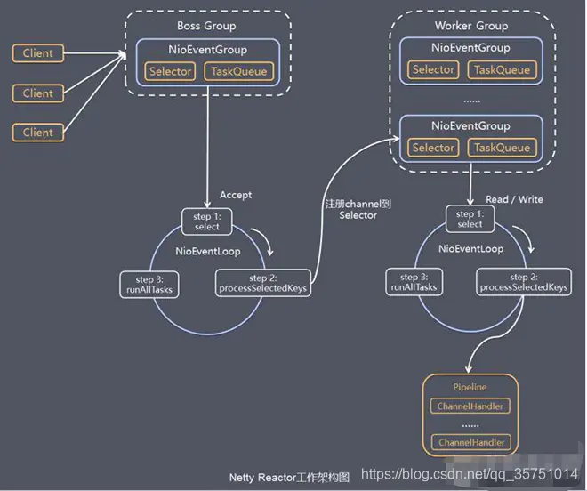

# Netty框架

> https://www.jianshu.com/p/6bbf21b6b5db

## 1. Netty框架介绍
1. Netty是 一个异步的，事件驱动的网络应用程序框架。

2. 对于JDK中的NIO进行了封装，且支持TCP和UDP网络通信且性能优异。比如：吞吐量更高：延迟更低；减少资源消耗；最小化不必要的内存复制。

3. 同时也支持FTP、SMTP、HTTP以及各种二进制和基于文本的传统协议。

## 2. 为什么用Netty
netty是一个网络编程框架，对于网络传输来说提供了更加简单的api，且性能优异。

## 3. Netty 应用场景

- 作为 RPC 框架的网络通信工具 ：我们在分布式系统中，不同服务节点之间经常需要相互调用，这个时候就需要 RPC 框架了。正所谓内部RPC外部REST ful。
- 实现一个即时通讯系统 ：使用 Netty 我们可以实现一个可以聊天类似微信的即时通讯系统。
- 实现消息推送系统。

## 4. Netty 高性能表现在哪些方面

- IO 线程模型：Netty的io线程模型采取了reactor主从模型，拥有很好的处理高并发的能力。
- 内存零拷贝：尽量减少不必要的内存拷贝，实现了更高效率的传输。
- 内存池设计：申请的内存可以重用，主要指直接内存。内部实现是用一颗二叉查找树管理内存分配情况。
- 串形化处理读写：避免使用锁带来的性能开销。
- 高性能序列化协议：支持 protobuf 等高性能序列化协议。

## 5. Netty线程模型
众所周知netty框架是一个高并发的网络框架，因为其有一个非常优秀的现成模式。为了对Netty的线程模式有一个更好地理解，需要系统性的了解一下java中的各种线程模式，最后通过Netty框架进行一个直观的对比。

## 6. JAVA中IO的线程模型

- 传统阻塞I/O服务模型
- Reactor模式

根据`Reactor`的数量和处理资源池线程的数量不同，有如下`3`种典型的实现

- 单`Reactor`单线程
- 单`Reactor`多线程
- 主从`Reactor`多线程

`Netty`线程模型主要基于**主从Reactor多线程模型**做了一定的改进，其中主从`Reactor`多线程模型有多个`Reactor`。

## 7. 传统阻塞I/O服务模型

- 模型图例

  

### **模型特点**

- 采用BIO模式读取数据。
- 客户端有连接请求时服务器端就需要启动一个线程进行处理，即**一个客户端连接对应一个服务端线程**。

### **问题分析**

- 当并发数很大，就会创建大量的线程，占用很大系统资源。
- 连接创建后，如果当前线程暂时没有数据可读，该线程会阻塞在`read`操作，造成线程资源浪费。 以上两点都是基于服务端资源浪费来说的，即消耗服务端线程资源，且连接后即使没有数据传输，依然占用服务端线程。

## 8. Reactor模型

这种模型也比较好理解，针对阻塞IO模型的两个缺点，进行改进。

- 基于 `I/O` 复用模型：多个连接共用一个阻塞对象，应用程序只需要在一个阻塞对象等待，无需阻塞等待所有连接。当某个连接有新的数据可以处理时，操作系统通知应用程序，线程从阻塞状态返回，开始进行业务处理。`Reactor` 对应的叫法: 1. 反应器模式 2. 分发者模式(`Dispatcher`) 3. 通知者模式(`notifier`)，我更倾向于叫分发者模式。
- 基于线程池复用线程资源：不必再为每个连接创建线程，将连接完成后的业务处理任务分配给线程进行处理，一个线程可以处理多个连接的业务。

　　

**其实通过我的角度来看reactor模型和阻塞模型的区别在于**：

Reactor模型通过在客户端和handler（处理io的对象）之间加了一层，对客户端和handler进行了解耦。

其实每个对于IO的操作都是阻塞的（从IO的角度），所以每个handler（实际处理io操作的对象）对象必然会阻塞线程，而Reactor模型在客户端和handler中增加了一层（又是通过增加一层的思路解决的，这种解耦思路比比皆是），也就是解耦了客户端请求和服务端handler，让多个客户端共用一个阻塞对象，这里用到的就是BIO多路复用IO的模型，多路socket连接，共用一个线程资源，也就解决了一个客户端连接占用一个服务端线程的问题同时具体处理io的操作交给handler线程池去处理，每个线程处理完事之后，可以做到线程回收复用。

**以上这句话简化点来说reactor模型的优点就是：**

1. 基于多路复用IO模型，解决了一个客户端连接对应一个服务端线程的弊端。

2. 对于handler（实际处理io的操作）基于线程池复用的模式，回收线程，并服用线程。

### 8.1 reactor模型的说明：

Reactor模式，通过一个或多个输入同时传递给服务处理器的模式（基于事件驱动，区别于阻塞io，只有通道中有数据传输的事件发生后，才给之分配服务端处理io的线程）。

- 服务器端程序处理传入的多个请求，并将它们同步分派到响应的处理线程，因此`Reactor`模式也叫`Dispatcher`模式。
- `Reactor`模式使用`IO`复用监听事件，收到事件后，分发的某个线程（进程），这点就是网络服务高并发处理的关键，其实高并发的一个思路就是减少无意的的线程浪费。

**Reactor模式中的核心组成部分：**

- Reactor：Reactor在一个单独的线程中运行，负责**监听和分发事件**，分发给适当的处理程序来对`IO`事件作出反应。
- Handlers：处理程序执行`I/O`事件要完成的实际事件，类似于客户想要与之交谈的公司中的实际官员。`Reactor`通过调度适当的处理程序来响应`I/O`事件，处理程序执行非阻塞操作。

这两部分简化一下说明：
1. reactor在一个单独的线程中运行，负责舰艇和分发事件。
2. hanlder负责处理IO事件。

### 8.2 单Reactor单线程模式

- 图例

  

- 说明：  
  acceptor：接收器，接收请求。  
  select:实现io监听。

- 模型说明：  
  这种模型很简单，就是handler和reactor共用一个线程。

- 缺点：  
  很明显，当并发量打的时候，同一时间只能处理一个io操作。

### 8.3 单Reactor多线程模型

- 图例

  

- 说明：  
  其实这个也很好理解，即reactor单独使用一个线程，处理io的操作交给线程池去处理。

- 缺点：  
  reactor处理所有的事件的监听和响应，在单线程运行， 在高并发场景容易出现性能瓶颈

### 8.4 主从Reactor多线程模型

- 模型

  

- 说明：  
  这种模式也比较好理解，针对于reactor单线程在并发场景下的瓶颈，让reactor在多线程中运行。  
  reactor分为多线程模式，主reactor只负责acceptor(接收请求)的业务，而多个子Reactor负责监听和分发。

  到此，Reactor模型的所有实现方式就都已经介绍完了，而**Netty才用的IO线程模型就是主从reactor模型**。

## 9. Netty模型

- 模型图列

  

### 模型说明

- Netty将Selector以及Selector相关的事件及任务封装了NioEventLoop，这样BossGroup就可以通过管理NioEventLoop去管理各个Selector。
- 同时，Netty模型中主要存在两个大的线程池组BossGroup和WorkerGroup，用于管理主Reactor线程和从Reactor线程。
- Netty抽象出两组线程池，BossGroup专门负责接收客户端的连接，WorkerGroup专门负责网络的读写
- BossGroup和WorkerGroup类型的本质都是NioEventLoopGroup类型。
- NioEventLoopGroup相当于一个线程管理器（类似于ExecutorServevice），它下面维护很多个NioEventLoop线程。
  1. 在初始化这两个Group线程组时，默认会在每个Group中生成CPU*2个NioEventLoop线程
  2. 当n个连接来了，Group默认会按照连接请求的顺序分别将这些连接分给各个NioEventLoop去处理。
  3. 同时Group还负责管理EventLoop的生命周期。
- NioEventLoop表示一个不断循环的执行处理任务的线程
  1. 它维护了一个线程和任务队列。
  2. 每个NioEventLoop都包含一个Selector，用于监听绑定在它上面的socket通讯。
  3. 每个NioEventLoop相当于Selector，负责处理多个Channel上的事件
  4. 每增加一个请求连接，NioEventLoopGroup就将这个请求依次分发给它下面的NioEventLoop处理。
- 每个Boss NioEventLoop循环执行的步骤有3步：
  1. 轮询accept事件
  2. 处理accept事件，与client建立连接，生成NioSocketChannel，并将其注册到某个Worker NioEventLoop的selector上。
  3. 处理任务队列到任务，即runAllTasks
- 每个Worker NioEventLoop循环执行的步骤：
  1. 轮询read，write事件
  2. 处理I/O事件，即read，write事件，在对应的NioSocketChannel中进行处理
  3. 处理任务队列的任务，即runAllTasks
- 每个 Worker NioEventLoop处理业务时，会使用pipeline（管道）<数据结构为双向链表>，pipeline中维护了一个ChannelHandlerContext链表，而ChannelHandlerContext则保存了Channel相关的所有上下文信息，同时关联一个ChannelHandler对象。如图所示，Channel和pipeline一一对应，ChannelHandler和ChannelHandlerContext一一对应 **由此可见每个worker上面通过pipeline管理多个socket的io操作**。

  

- ChannelHandler 是一个接口，负责处理或拦截I/O操作，并将其转发到Pipeline中的下一个处理`Handler`进行处理。


```ruby
                                                 I/O Request
                                            via Channel or
                                        ChannelHandlerContext
                                                      |
  +---------------------------------------------------+---------------+
  |                           ChannelPipeline         |               |
  |                                                  \|/              |
  |    +---------------------+            +-----------+----------+    |
  |    | Inbound Handler  N  |            | Outbound Handler  1  |    |
  |    +----------+----------+            +-----------+----------+    |
  |              /|\                                  |               |
  |               |                                  \|/              |
  |    +----------+----------+            +-----------+----------+    |
  |    | Inbound Handler N-1 |            | Outbound Handler  2  |    |
  |    +----------+----------+            +-----------+----------+    |
  |              /|\                                  .               |
  |               .                                   .               |
  | ChannelHandlerContext.fireIN_EVT() ChannelHandlerContext.OUT_EVT()|
  |        [ method call]                       [method call]         |
  |               .                                   .               |
  |               .                                  \|/              |
  |    +----------+----------+            +-----------+----------+    |
  |    | Inbound Handler  2  |            | Outbound Handler M-1 |    |
  |    +----------+----------+            +-----------+----------+    |
  |              /|\                                  |               |
  |               |                                  \|/              |
  |    +----------+----------+            +-----------+----------+    |
  |    | Inbound Handler  1  |            | Outbound Handler  M  |    |
  |    +----------+----------+            +-----------+----------+    |
  |              /|\                                  |               |
  +---------------+-----------------------------------+---------------+
                  |                                  \|/
  +---------------+-----------------------------------+---------------+
  |               |                                   |               |
  |       [ Socket.read() ]                    [ Socket.write() ]     |
  |                                                                   |
  |  Netty Internal I/O Threads (Transport Implementation)            |
  +-------------------------------------------------------------------+
```


