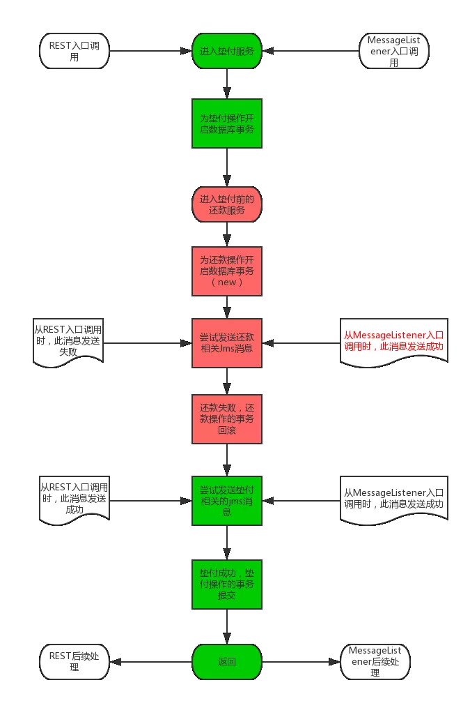

# Jms的MessageListener中的Jms事务

## 摘要

一般来说，如果为JmsTemplate做了事务配置，那么它将会与当前线程的数据库事务挂钩，并且仅在数据库事务的afterCommit动作中提交。

但是，如果一个MessageListener在接收Jms消息的同时，也使用JmsTemplate发送了Jms消息；那么它发送的Jms消息将与数据库事务无关（即使为JmsTemplate做了事务配置），而是与Listener接收消息保持在同一个事务中。

## 问题

问题是一位同事发现的。

账务系统的垫付功能存在REST和MessageListener两个入口；两个入口中调用的是同一套代码和业务逻辑。但是，REST入口中发送的Jms消息会随着数据库事务回滚而回滚；MessageListener中却不会回滚。相关流程图说明如下。

我们期望的结果是：在还款操作中发送的Jms消息，随还款操作的数据库事务回滚而取消（红色底色部分的操作）；而垫付操作中发送的Jms消息，则应随垫付操作的数据库事务提交而提交（绿色底色部分的操作）。这一点在REST入口的相关日志和数据中得到了验证。但是，从MessageListener入口调用此服务时，却出现了问题：虽然还款服务的数据库事务确实回滚了，但是其中的Jms消息却成功发送了出来（参见红色字体部分）。



## 分析

首先，REST入口的操作、结果是正确的。这说明，当数据库事务回滚时，Jms消息确实没有提交。那么，可以肯定一点：一定是MessageListener后续处理中做了提交消息这个动作。

经过一系列的Debug和逐行执行、分析，我找到了这段代码。

MessageListener接收到消息后，会进入org.springframework.jms.listener.AbstractPollingMessageListenerContainer.receiveAndExecute( Object invoker,  Session session,  MessageConsumer consumer)方法中。由于没有配置transactionManager，我们会通过doReceiveAndExecute(invoker, session, consumer, null)来调用org.springframework.jms.listener.AbstractPollingMessageListenerContainer.doReceiveAndExecute( Object invoker,  Session session,  MessageConsumer consumer,  TransactionStatus status) 方法。

```java
/**
 * Execute the listener for a message received from the given consumer,
 * wrapping the entire operation in an external transaction if demanded.
 * @param session the JMS Session to work on
 * @param consumer the MessageConsumer to work on
 * @return whether a message has been received
 * @throws JMSException if thrown by JMS methods
 * @see #doReceiveAndExecute
 */
protected boolean receiveAndExecute(Object invoker, Session session, MessageConsumer consumer)
        throws JMSException {
    if (this.transactionManager != null) {
        // Execute receive within transaction.
        TransactionStatus status = this.transactionManager.getTransaction(this.transactionDefinition);
        boolean messageReceived;
        try {
            messageReceived = doReceiveAndExecute(invoker, session, consumer, status);
        }
        catch (JMSException ex) {
            rollbackOnException(status, ex);
            throw ex;
        }
        catch (RuntimeException ex) {
            rollbackOnException(status, ex);
            throw ex;
        }
        catch (Error err) {
            rollbackOnException(status, err);
            throw err;
        }
        this.transactionManager.commit(status);
        return messageReceived;
    }
    else {
        // Execute receive outside of transaction.
        return doReceiveAndExecute(invoker, session, consumer, null);
    }
}
```

doReceiveAndExecute方法又会调用org.springframework.jms.listener.AbstractMessageListenerContainer.doExecuteListener( Session session,  Message message)方法，以便于执行我们编写的业务代码，并处理Jms相关的事务。如果业务代码中没有抛出异常，那么就会进入org.springframework.jms.listener.AbstractMessageListenerContainer.commitIfNecessary( Session session,  Message message)方法中。

```java
/**
 * Execute the specified listener,
 * committing or rolling back the transaction afterwards (if necessary).
 * @param session the JMS Session to operate on
 * @param message the received JMS Message
 * @throws JMSException if thrown by JMS API methods
 * @see #invokeListener
 * @see #commitIfNecessary
 * @see #rollbackOnExceptionIfNecessary
 * @see #convertJmsAccessException
 */
protected void doExecuteListener(Session session, Message message) throws JMSException {
    if (!isAcceptMessagesWhileStopping() && !isRunning()) {
        if (logger.isWarnEnabled()) {
            logger.warn("Rejecting received message because of the listener container " +
                    "having been stopped in the meantime: " + message);
        }
        rollbackIfNecessary(session);
        throw new MessageRejectedWhileStoppingException();
    }
    try {
        invokeListener(session, message);
    }
    catch (JMSException ex) {
        rollbackOnExceptionIfNecessary(session, ex);
        throw ex;
    }
    catch (RuntimeException ex) {
        rollbackOnExceptionIfNecessary(session, ex);
        throw ex;
    }
    catch (Error err) {
        rollbackOnExceptionIfNecessary(session, err);
        throw err;
    }
    commitIfNecessary(session, message);
}
```

commitIfNecessary方法几经辗转，最终会调用到org.apache.activemq.ActiveMQConnection.syncSendPacket( Command command) 方法。这个方法的作用，是将当前Connection中的数据同步到MQ服务端。也就是在这个方法执行完毕之后，不应当发送的消息被发送了出去。

```java
public Response syncSendPacket(Command command) throws JMSException {
    if (isClosed()) {
        throw new ConnectionClosedException();
    } else {
        try {
            Response response = (Response)this.transport.request(command);
            if (response.isException()) {
                ExceptionResponse er = (ExceptionResponse)response;
                if (er.getException() instanceof JMSException) {
                    throw (JMSException)er.getException();
                } else {
                    if (isClosed()||closing.get()) {
                        LOG.debug("Received an exception but connection is closing");
                    }
                    JMSException jmsEx = null;
                    try {
                        jmsEx = JMSExceptionSupport.create(er.getException());
                    } catch(Throwable e) {
                        LOG.error("Caught an exception trying to create a JMSException for " +er.getException(),e);
                    }
                    if (er.getException() instanceof SecurityException && command instanceof ConnectionInfo){
                        forceCloseOnSecurityException(er.getException());
                    }
                    if (jmsEx !=null) {
                        throw jmsEx;
                    }
                }
            }
            return response;
        } catch (IOException e) {
            throw JMSExceptionSupport.create(e);
        }
    }
} 
```

这就是消息被错误发送的原因：MessageListener在接收消息的时候，获取了一个Connection；后续发送消息时，用的是同一个Connection。因此，尽管中间的数据库事务回滚了，但由于这个Connection最终要提交（MessageListner中没有抛出异常），用这个Connection发送的所有消息最终都被提交到了MQ上。

## 解决方案

### 方案一：使用JmsTransactionManager来管理Jms事务

可以通过以下配置，为MessageListner注入JmsTransactionManager：

```xml
<bean id="jmsTransactionManager"
    class="org.springframework.jms.connection.JmsTransactionManager">
    <property name="connectionFactory" ref="jmsConnectionFactory" />
</bean> 
 
<jms:listener-container destination-type="queue"
    transaction-manager="jmsTransactionManager" concurrency="4"
    acknowledge="transacted" connection-factory="jmsConnectionFactory">
    <jms:listener destination="queue.thread.autopay" ref="autoPayListener" />
</jms:listener-container>
```

但是在测试后发现，这样配置并没有用。我分析，JmsTransactionManager并不能为@Transactional(propagation = Propagation.REQUIRES_NEW)注解创建新的JmsConnection，因而，发送消息使用的仍然是接收消息时创建的connection。由于MessageListener中并没有抛出异常，JmsTransactionManager仍然会提交这个connection中的数据，并最终导致消息提交。

### 方案二：手动将发送消息的操作放到数据库事务的AfterCommit操作中

现有代码中，我们是在事务体内执行JmsTemplate.send()操作；在事务的AfterCommit操作中执行Session.commit()。

如果我们将JmsTemplate.send()操作放到AfterCommit操作中，那么就可以确保只在数据库事务提交后，才会提交Jms消息了。

此方案验证可行。验证代码如下：

```java
public void send(Event event, List<TransferParam> transferParams) {
    TransactionSynchronizationManager
        .registerSynchronization(new TransactionSynchronizationAdapter() {
            @Override
            public void afterCommit() {
                System.out.println(this.getClass() + " - " + event + "--"
                    + transferParams);
                try {
                    event.getTychoOperType().ifPresent(
                        (value) -> {
                            TychoProductor4Account.this.doSend(event,
                                transferParams);
                        });
                } catch (Exception e) {
                    System.out.println(e.getMessage());
                    TychoProductor4Account.LOGGER.error("发送数据到tycho异常:{}",
                        e);
                }
            }
        });
}
```

### 方案三：手动在数据库事务的RollBack操作中回滚Jms消息

暂未找到实现方式。

### 方案四：尝试为发送消息创建并使用新的Connection

代码流程中之所以会使用同一个Connection，是因为接收、发送消息时，都是从线程上下文中尝试获取JmsResourceHolder，并从其中获取连接的。

那么，简单做法就是在接收到消息后，开启一个子线程；复杂做法则是为JmsTransactionManager编写识别@Transactional(propagation = Propagation.REQUIRES_NEW)注解的功能。

开启子线程的方案可行。验证代码如下：

```java
Future<Event> actualResult = this.keplerRestExecutor.submit(() -> {
            Event4Reserve event4Reserve = new Event4Reserve();
            event4Reserve.setRecordId(recordId);
            event4Reserve.setUserId(ThreadConsts.SYSTEM_USER_ID);
            AutoPayListener4BaeEvent.LOGGER.debug("event4Reserve={}",
                event4Reserve);
            Event result = this.bizAccountEventService.handle(event4Reserve);
            AutoPayListener4BaeEvent.LOGGER.info("result={}", result);
            return result;
        });
        try {
            actualResult.get();
        } catch (InterruptedException e) {
            AutoPayListener4BaeEvent.LOGGER.error("线程被中断！", e);
            throw new RuntimeException("垫付线程中断！", e);
        } catch (ExecutionException e) {
            AutoPayListener4BaeEvent.LOGGER.error("执行过程出错！", e);
            Throwable real = e.getCause();
            if (real instanceof RuntimeException) {
                throw (RuntimeException) real;
            } else {
                throw new RuntimeException(real);
            }
        }
```

### 方案五：使用org.springframework.jms.connection.CachingConnectionFactory

已验证，方案无效。

测试配置如下：

```xml
<bean id="jmsTransactionManager"
    class="org.springframework.jms.connection.JmsTransactionManager">
    <property name="connectionFactory" ref="jmsConnectionFactory" />
</bean>
<bean id="jmsConnectionFactory"
    class="org.springframework.jms.connection.CachingConnectionFactory">
    <property name="targetConnectionFactory" ref="targetActiveMqConnectionFactory" />
    <property name="sessionCacheSize" value="10" />
</bean>
<amq:connectionFactory id="targetActiveMqConnectionFactory"
    brokerURL="${jms.url.failover}">
    <amq:redeliveryPolicyMap>
        <amq:redeliveryPolicyMap>
            <amq:defaultEntry>
                <!-- 5次，每次30秒 -->
                <amq:redeliveryPolicy maximumRedeliveries="5"
                    initialRedeliveryDelay="30000" />
            </amq:defaultEntry>
            <amq:redeliveryPolicyEntries>
                <!-- 5次，每次10秒 -->
                <amq:redeliveryPolicy queue="queue.thread.autopay"
                    maximumRedeliveries="5" initialRedeliveryDelay="10000" />
            </amq:redeliveryPolicyEntries>
            <amq:redeliveryPolicyEntries>
                <!-- 银联实时划扣超时限制 ，5次，每次90秒 -->
                <amq:redeliveryPolicy queue="queue.thread.instantUnionpay"
                    maximumRedeliveries="5" initialRedeliveryDelay="90000" />
            </amq:redeliveryPolicyEntries>
        </amq:redeliveryPolicyMap>
    </amq:redeliveryPolicyMap>
</amq:connectionFactory>
 
<jms:listener-container destination-type="queue"
    transaction-manager="jmsTransactionManager" concurrency="4"
    acknowledge="transacted" connection-factory="jmsConnectionFactory">
    <jms:listener destination="queue.thread.autopay" ref="autoPayListener" />
</jms:listener-container>
```

### 方案六：为jmsTemplate和MessageListener配置不同的ConnectionFactory

验证可行。测试配置如下：

```xml
<bean id="newJmsTemplate" class="org.springframework.jms.core.JmsTemplate">
    <property name="connectionFactory" ref="targetActiveMqConnectionFactory" />
    <property name="sessionTransacted" value="true" />
    <property name="explicitQosEnabled" value="${activemq.explicitQosEnabled}" />
    <property name="timeToLive" value="86400000" />
</bean>
<amq:connectionFactory id="targetActiveMqConnectionFactory"
    brokerURL="${jms.url.failover}">
</amq:connectionFactory>
 
<jms:listener-container destination-type="queue"
    concurrency="4" acknowledge="transacted" connection-factory="jmsConnectionFactory">
    <jms:listener destination="queue.thread.autopay" ref="autoPayListener" />
</jms:listener-container>
<amq:connectionFactory id="jmsConnectionFactory"
    brokerURL="${jms.url.failover}">
</amq:connectionFactory>
```

后续工作
基本已经验证完毕。

 

### 小结

可行方案有三个，分别是**方案二**：手动将发送消息的操作放到数据库事务的AfterCommit操作中、**方案四**：尝试为发送消息创建并使用新的Connection、**方案六**：为jmsTemplate和MessageListener配置不同的ConnectionFactory。比较简便的方式是方案六，其它方式都需要修改代码。
